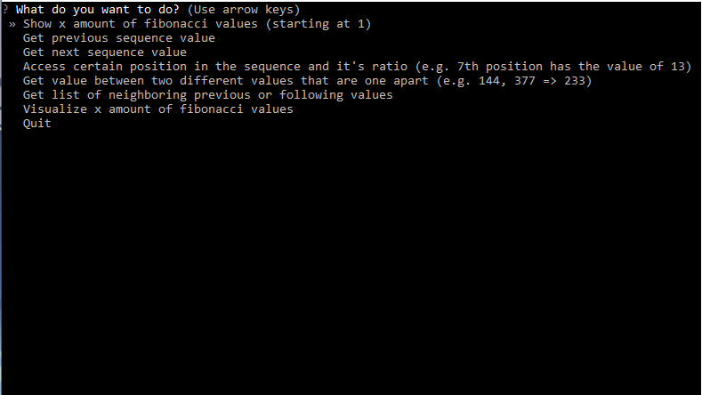

<br/>
<p align="center">
  <a href="https://github.com/ThatLukaszGuy/Fibonacci-Sequence">

<h3 align="center">Fibonacci Sequence</h3>
  </a>

  <p align="center">
    A small app to practice basic logic
    <br/>
    <br/>
  </p>
</p>

## Table Of Contents

- [Table Of Contents](#table-of-contents)
- [About The Project](#about-the-project)
- [Getting Started](#getting-started)
  - [Afterword](#afterword)

## About The Project

This was originally a simple project to practice recursion and only later changed to an actual small app. There are six basic things you can do : 
<ul>
    <li> Generating a certain amount of numbers from the fibonacci sequence </li>
    <li> Getting the value of the next numbere in the sequence </li>
    <li> Getting the value of the next numbere in the sequence </li>
    <li> Access a specific postion (e.g. 7th position) and getting its value </li>
    <li> Access a value that is between two values in the sequence (e.g get the number 233 that is between 144 and 377) </li>
    <li> Get list of neighboring previous or following values </li> 
    <li> Visualizing a certain amount of values in a simple graph </li>
</ul>

<b>little warning: The .exe has a slower start-up time (about 5 seconds) and can't handle generating more than 5000 instances at once. If that's what u need it's recommended to run the ``run.py`` file after installing all dependencies</b>




## Getting Started

Just run the .exe file after cloning/downloading the repo. If that is too slow just run ```run.py``` file after installing all dependencies

### Afterword

Do whatever you want , it's not really the finest piece of work.
